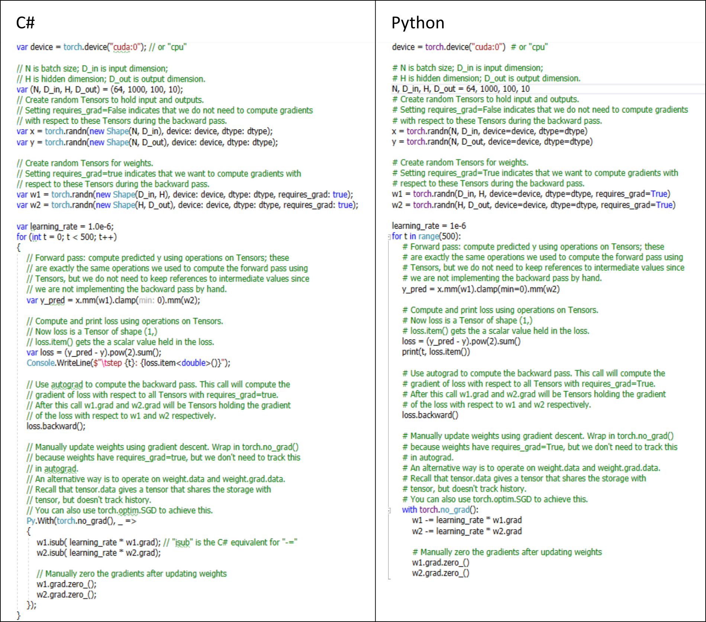

**Torch.NET** brings the awesome [PyTorch](https://pytorch.org) library to the .NET world. It offers Tensor computations and Neural Network modules with efficient GPU or multi-core CPU processing support and is to be considered one of the fundamental libraries for scientific computing, machine learning and AI. Torch.NET empowers .NET developers to leverage PyTorch's extensive functionality including computational graphs with with multi-dimensional arrays, back-propagation, neural network implementations and many more via a compatible strong-typed API.

Check out this [example](src/Examples/SimpleNeuralNetworkExample/Program.cs) fitting a two-layer neural network against random data in C# and Python: 

## Dependencies
You need **Python 3.7** and **PyTorch** installed on your System for Torch.NET to work.

## Status

Torch.NET is currently under very busy construction. The entire torch.* API has been completed. If you execute the unit tests you'll see that tensors can be created on CPU and GPU and operations can be performed on them.

### Completion
The checked categories have been wrapped.
- [x] torch
- [x] torch.Tensor
- [x] Tensor Attributes
- [x] Type Info
- [ ] torch.sparse
- [ ] torch.cuda
- [ ] torch.Storage
- [x] torch.nn
- [ ] torch.nn.functional
- [ ] torch.nn.init
- [ ] torch.optim
- [ ] torch.autograd
- [ ] torch.distributed
- [ ] torch.distributions
- [ ] torch.hub
- [ ] torch.jit
- [ ] torch.multiprocessing
- [ ] torch.utils.bottleneck
- [ ] torch.utils.checkpoint
- [ ] torch.utils.cpp_extension
- [ ] torch.utils.data
- [ ] torch.utils.dlpack
- [ ] torch.utils.model_zoo
- [ ] torch.utils.tensorboard (experimental)
- [ ] torch.onnx
- [ ] torch.__config__

## Release

[Torch.NET 1.0.0](https://www.nuget.org/packages/Torch.NET/1.0.0) on Nuget.org
